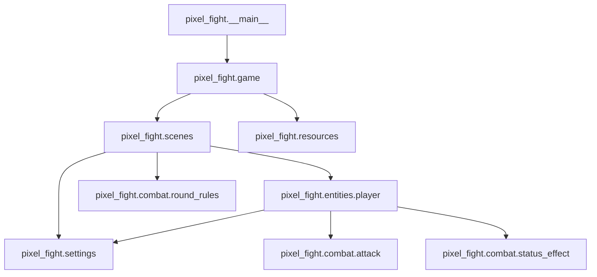

# Architecture

## Implemented structure

Pixel Fight uses a conventional `src` package without introducing a framework
or unnecessary abstraction layers.

```text
src/pixel_fight/
├── __init__.py
├── __main__.py
├── game.py
├── settings.py
├── combat/
│   ├── attack.py
│   ├── round_rules.py
│   └── status_effect.py
├── entities/
│   └── player.py
├── resources/
│   └── asset_manager.py
└── scenes/
    ├── base.py
    ├── menu.py
    ├── selection.py
    └── battle.py
```

Repository-level concerns remain outside the runtime package:

- `assets/` contains runtime images and fonts.
- `docs/` contains architecture, audits, release guidance, and screenshots.
- `scripts/` contains validation, smoke, and release helpers.
- `packaging/windows/` contains the PyInstaller specification.
- `tests/` separates unit, integration, and release validation.
- `pyproject.toml` owns package metadata, dependencies, entry points, and
  pytest configuration.

## Responsibilities

### Entry point and application

`pixel_fight.__main__` constructs `Game` and calls `run()`. Importing it has no
Pygame initialization side effect.

`pixel_fight.game` owns Pygame lifecycle, display, clock, one event loop,
current scene, transitions, and `GameContext`. It does not implement combat
rules.

`pixel_fight.settings` owns window, timing, color, controls, fighter, and attack
configuration. The current Python data structures remain intentionally small;
there is no JSON/YAML configuration layer.

### Scenes

- `menu` owns mouse/keyboard menu navigation and the controls overlay.
- `selection` owns selected fighters and cached previews.
- `battle` owns match/round state, HUD rendering, pause, scoring, and Player
  coordination.
- `base` defines only the minimal scene/transition contract.

Battle result remains a sub-state rather than a separate scene.

### Entities and combat

`entities.player` owns per-fighter movement, stats, primary action, animation,
attack activation/resolution, and active status instances. One Player class is
used for both local players.

`combat.attack` defines immutable move data and hitbox/active-frame helpers.
`combat.round_rules` contains Pygame-independent round/scoring decisions.
`combat.status_effect` contains timed effect records and tint ordering.

### Resources

`resources.asset_manager` resolves assets from the repository root during
source execution and from PyInstaller's bundle root when frozen. It owns image,
font, animation, and overlay caches. One instance belongs to `GameContext`; it
is not a global singleton.

## Dependency direction



Combat and resource modules never import scenes or Game. Game coordinates
scenes but does not know attack/status implementation details.

## Deliberate non-abstractions

- No ECS, service locator, command bus, repository layer, event bus, or plugin
  system.
- No class hierarchy for attacks or effects.
- No generic scene graph.
- No separate scene for the battle result.
- No JSON/YAML layer for four fighters.
- No `ui/` package until HUD behavior has a genuine independent boundary.

`entities/player.py` and `scenes/battle.py` remain the largest modules. Their
size alone is not justification for splitting them during the package move.
Any later extraction should be behavior-driven and independently tested.

## Runtime and development entry points

Install for source development:

```powershell
python -m pip install -e ".[dev]"
```

Run with either registered entry point:

```powershell
python -m pixel_fight
pixel-fight
```

Windows packaging points PyInstaller at
`src/pixel_fight/__main__.py` with `src/` on its analysis path.
