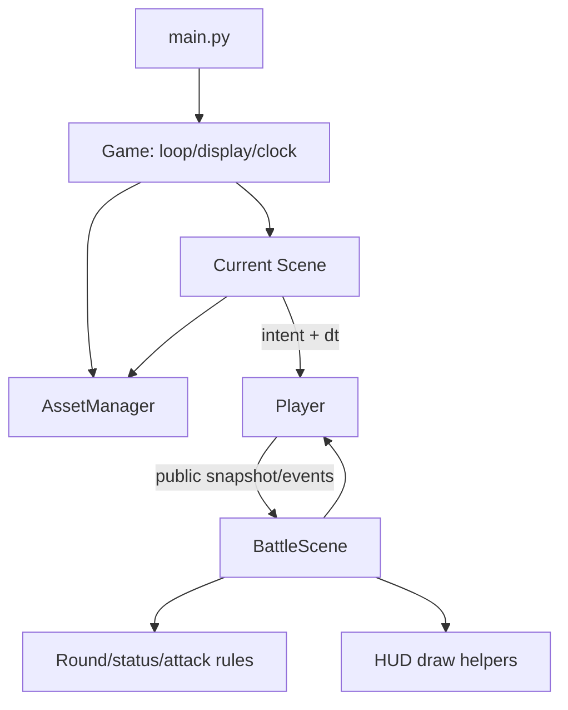

# Architecture Proposal

## Recommendation

Pixel Fight needs a small scene-based core, not a framework. The minimum useful
target is one application loop, three scenes, a Player entity, centralized
settings/character data, and a tiny asset cache. Combat/status modules should
appear only when their logic is extracted and tested; they do not need engines,
dependency injection containers, event buses, or generic entity-component
systems.

```text
src/
├── main.py
├── game.py
├── settings.py
├── scenes/
│   ├── menu_scene.py
│   ├── selection_scene.py
│   └── battle_scene.py
├── entities/
│   └── player.py
├── combat/
│   ├── attack.py
│   └── status_effect.py
├── resources/
│   └── asset_manager.py
└── ui/
    └── hud.py
```

This is a destination map, not a requirement to create every file immediately.
A still smaller intermediate architecture is recommended:

```text
main.py
game.py
settings.py
player.py
scenes.py
asset_manager.py
```

The Phase 2 baseline now uses this intermediate root-level `asset_manager.py`.
It should move under `src/resources/` only during a later package migration;
its cache and source-root path behavior should be preserved.

Split `scenes.py` and move into `src/` only when file size or packaging makes
the benefit concrete.

## Responsibilities

### `main.py`

Keep it boring: construct `Game`, call `run()`, and return an exit code. Pygame
initialization and shutdown should happen inside this executable path, never as
import side effects.

### `game.py`

Own the display, clock, one event loop, current scene, and transitions. A scene
can return a small enum/value such as `MENU`, `SELECT`, `BATTLE`, or `QUIT`.
`Game` should not know attack rules.

### `settings.py`

Hold window/FPS/colors, asset-root calculation, and typed or validated character
configuration. Preserve the current data shape initially, adding an explicit
case-correct `asset_dir`. Avoid a configuration framework; dictionaries or
small frozen dataclasses are enough.

### Scenes

- Menu owns buttons and its controls overlay.
- Selection owns selected indices and preview timing, requesting cached
  portraits/idle frames.
- Battle owns match/round state, timer, scoring, two Players, HUD coordination,
  and result timing. A result can remain a sub-state of Battle until it becomes
  complex enough for its own scene.

Use a minimal interface such as `handle_event(event)`, `update(dt_ms)`, and
`draw(surface)`. Do not build a generic scene graph.

### `entities/player.py`

Own per-fighter position, primary action, stats, animation playback, and
controlled mutations. Input mappings should be passed in; Player should not
branch on player number. Gradually separate input intent, physics, combat
request, and animation while keeping one class until a split demonstrably
helps.

### `combat/attack.py`

Do not create this just to wrap three methods. Add it in the combat phase when
attack data gains startup/active/recovery frames, configurable hitboxes, and
one-hit tracking. A frozen dataclass plus resolver functions is sufficient.

### `combat/status_effect.py`

Add when burn/freeze timing moves out of the battle loop. Keep a small enum/data
record and pure update functions. Player can own its active effect collection;
BattleScene can coordinate result implications. No inheritance hierarchy is
needed for four effects.

### `resources/asset_manager.py`

Resolve paths from the source/project root and cache original images, scaled
frames, fonts, and simple transforms. Fail fast with a path-specific error.
Avoid a global singleton; one instance owned by `Game` and passed to scenes is
enough.

### `ui/hud.py`

Extract only after BattleScene exists. It should draw health, energy, timer,
names, and score from supplied values without mutating game state.

## What to preserve

- Pygame and the direct 2D loop.
- Fixed-size pixel-art presentation until scaling is an explicit feature.
- Simple character configuration and ten-row spritesheet convention.
- A single Player class for both local players.
- Direct, readable collision rectangles.
- Existing assets, controls, timings, and balance as the refactor baseline.

## What not to abstract

- No ECS, service locator, command bus, repository layer, plugin system, network
  protocol, physics engine, or general-purpose animation graph.
- No base class for one concrete scene family beyond a small protocol, unless
  type checking actually benefits.
- No separate class for every attack/status before data and tests require it.
- No JSON/YAML config merely to move four dictionaries out of Python.
- No asset pipeline or atlas format conversion without a measured problem.

## Incremental migration


1. **Characterize first.** Add asset/startup checks and pure tests for any
   extracted scoring logic. Record visual/timing baselines.
2. **Fix resource boundaries.** Introduce source-anchored paths and caching
   while functions remain in `main.py`.
3. **Create a real `main()`.** Move initialization/shutdown inside it. A small
   `Game` object may initially call the existing loops, preserving behavior.
4. **Migrate menu.** Give it event/update/draw methods; keep controls as an
   overlay. The old outer flow can adapt its result temporarily.
5. **Migrate selection.** Move selected indices/preview timing and use cache.
6. **Migrate battle.** Move globals into BattleScene fields without changing
   combat order. Replace blocking victory wait with a timed sub-state only in a
   separately reviewed change.
7. **Extract rules.** One pure round resolver first, then timed status updates.
8. **Refactor Player.** Controls mapping and smaller methods, protected by
   behavior tests.
9. **Move into `src/`.** Do this after imports and asset roots are explicit, as
   its own mechanical change with README/build updates.

At every step, retain a runnable adapter/entry point and remove the old path only
after the new path passes the same smoke and manual checks.

## Minimal end-state data flow



The central principle is ownership: Game owns application lifecycle, a scene
owns its screen/match state, Player owns per-fighter state, and pure combat
rules decide mutations. That is enough structure for this project's likely
growth without turning it into an enterprise application.
