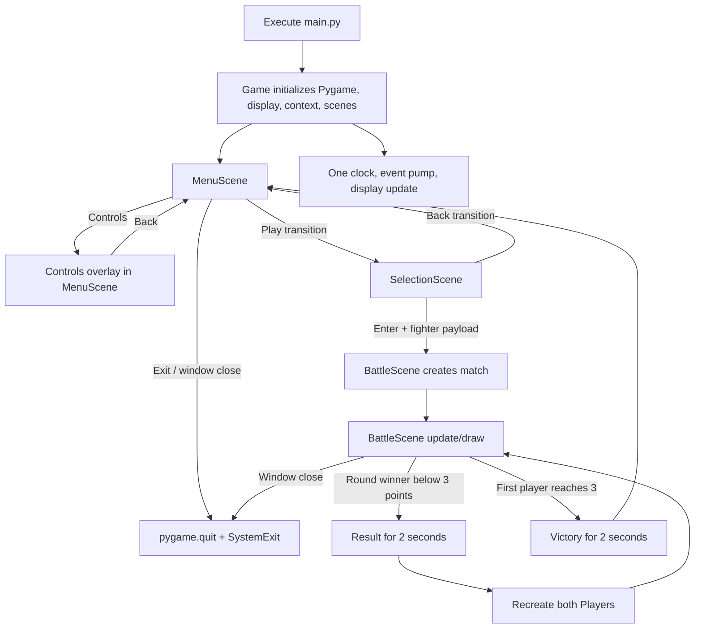
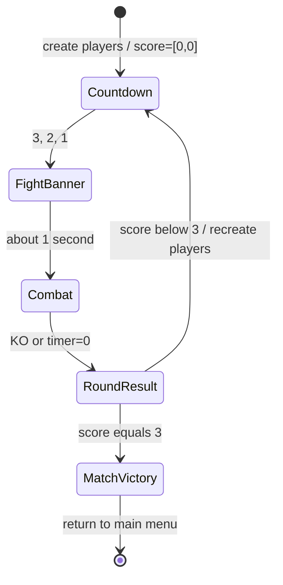
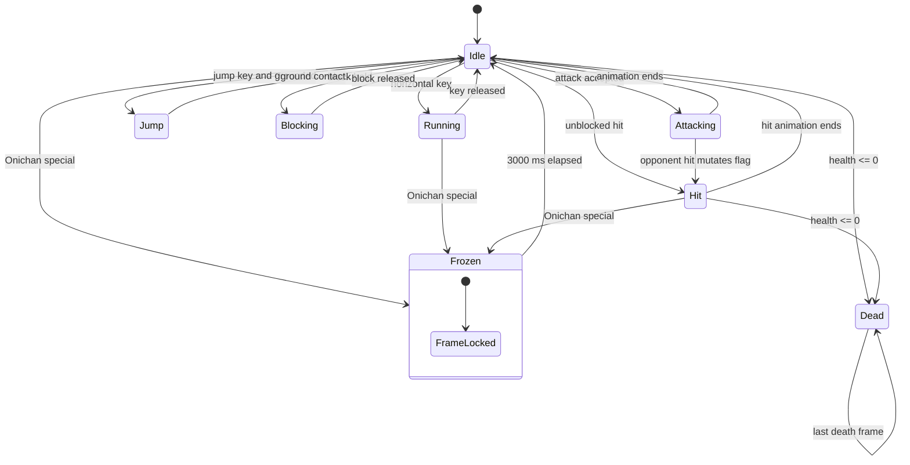
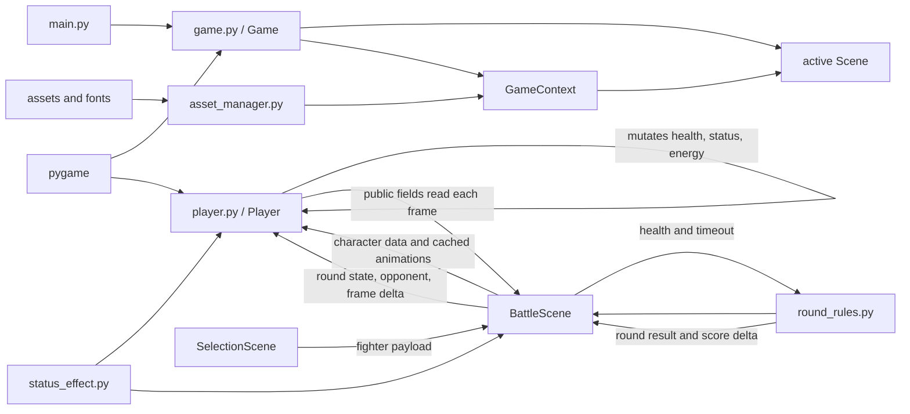

# Current State

This document records current repository behavior after completed roadmap
phases. It describes what the code does, including remaining inconsistencies,
rather than a desired design.

## Repository and runtime baseline

- Runtime modules exist at repository root: `main.py`, `game.py`, `settings.py`,
  `player.py`, `round_rules.py`, `asset_manager.py`, and `status_effect.py`.
- `scenes/` contains a minimal transition contract plus menu, selection, and
  battle scenes. There is still no `src/` package or packaging metadata.
- Python 3.13.0 and Pygame 2.6.1 are the documented and locally validated
  versions.
- The window is fixed at 1000×600 and the target loop rate is 60 FPS.
- Asset loading is anchored to the repository-local `assets/` directory and is
  independent of launch CWD.

## Complete application flow

### Startup

`main.py` only defines/calls `main()`. Constructing `Game` initializes Pygame,
opens the fixed 1000×600 display, creates the clock/context/scenes, and enters
MenuScene. Importing `main` does not initialize Pygame. `Game.run()` guarantees
`pygame.quit()` in `finally`.

### Main menu and controls

`MenuScene` uses cached `scrolling.png` and `controls.png`, scrolls two copies of
the background by 0.2 px per frame, and draws Play, Controls, and Exit
rectangles. Only mouse clicks operate these buttons.

Controls remains an overlay rather than a separate scene. While it is open,
underlying buttons remain drawn and their click handlers remain active,
preserving baseline behavior. Play requests SelectionScene; Exit requests the
global Quit transition.

### Character selector

Selection starts with Raruto for Player 1 and Bam for Player 2. `W/S` and
Up/Down wrap through the four-item list. Both may select the same fighter. The
central list outlines each player's choice; a shared choice alternates color
using wall-clock `time.time()`.

When the selector is entered, all four portraits and idle-frame lists are
requested once from `AssetManager`. Each selector frame then:

1. scrolls and draws the background;
2. renders labels and choices;
3. retrieves both portraits and idle-frame lists from in-memory caches;
4. advances one shared preview frame index about every 100 ms;
5. handles keyboard/mouse events.

Enter requests BattleScene with the two shared configuration dictionaries as
payload. Back explicitly requests MenuScene. Entering either scene resets its
local UI/match state.

## Match lifecycle

### Creation and round reset

BattleScene entry resets `score` to `[0, 0]`, obtains cached animations, and
calls `reset_round()`, which constructs Players at `(200, 310)` and
`(700, 310)`. Player 2 starts flipped.

`reset_round()` resets `round_start_time`, `round_over`, `intro_count`,
`fight_displayed`, `fight_display_start`, `last_count_update`,
`round_over_time`, and `winner_name`. Match setup and every later round use
this function. Between rounds both Players are reconstructed from already-loaded
sheets, resetting health, energy, movement, combat, freeze, burn, dash, and
animation fields.

### Countdown, banner, and timer

`ROUND_TIME_LIMIT` is 94,000 ms. The timer starts before the three-second
countdown. After 3 reaches 0, “FIGHT!” appears for about one second. Movement is
enabled afterward, so controllable combat lasts approximately 90 seconds. The
timer is hidden until it reaches 91 seconds and displays truncated integers.
Fighters still run `update()` and draw during the intro, but `move()` is not
called.

### Per-frame combat order

The single Game loop obtains events and delta time once. BattleScene then:

1. caps frame rate;
2. calculates time remaining;
3. draws scaled background and HUD;
4. draws countdown/banner or, while time remains, calls `move()` for Player 1
   then Player 2;
5. updates each Player's effects, animations, and death state, then draws both;
6. resolves KO/timeout/draw once and applies its score delta;
7. handles result/victory and possibly recreates players;
8. draws cached overlays for all active burn/freeze effects;
9. returns control to Game, which performs the only display update.

The ordering matters: Player-owned burn damage is applied before the outcome
resolver, so a lethal tick ends the round in the same frame. Player 1
movement/attack is still processed before Player 2, which can affect same-frame
interactions.

### KO, timeout, scoring, and victory

- If time expires, higher health receives one score point. Equal health sets
  `winner_name = "No One"` and awards no point.
- A single pure resolver in `round_rules.py` handles both KO and timeout.
  Simultaneous KO is a draw and awards no point.
- During `round_over`, the winner text is shown while Player animations/status
  processing continue.
- Below three points, two seconds after `round_over_time`, both Players are
  recreated and countdown starts again.
- At exactly three points, victory text remains visible for two seconds through
  a non-blocking timer; window-close events continue to work.
- When that timer ends, BattleScene requests MenuScene. There is no direct
  rematch or selector transition.

## Player behavior

This diagram is approximate because booleans can overlap. `dashing` and
`burned` are orthogonal flags; freeze can coexist with them. Animation action
priority and freeze's early return determine what is visible.

### Movement and facing

`move()` polls the entire keyboard state. Normal input is permitted only when
not attacking, alive, round active, and not frozen. Walk speed is 10 px per
battle frame, gravity is 2 velocity units per frame, and jump velocity begins
at -30. The floor is `screen_height - 110`; only horizontal screen edges and
the floor are enforced. There is no ceiling, player-player collision, knockback,
or stage geometry. Facing is recalculated from opponent center positions after
movement.

### Attacks and collision

All players share an 80×180 body rectangle, independent of sprite scale.
Attack rectangles extend from the attacker's center in the facing direction
and retain the body height. Normal/special damage is evaluated immediately at
activation. The `surface` arguments to attack methods are unused; debug hitbox
drawing is absent.

Attack input is disabled while `attacking`; when the selected attack animation
ends, a 30-frame cooldown begins. If a key remains held, the attack will fire
again when the cooldown reaches zero. Cooldown decrements only when `move()` is
called, so it pauses during countdown/result and stretches when FPS falls.

### Health, energy, block

Health and energy start at 100 and 10. Normal attacks give the attacker 20
energy for an unblocked hit or 10 when blocked. Energy above 100 is clamped on
the next `update()`. Health above 100 is likewise clamped. Health at or below
zero is set to zero and marks the player dead.

Block is a held state. It cancels input inside its branch but does not have a
time limit. Because block is only refreshed inside the normal-input gate, the
flag may remain true while an incompatible gate such as freeze or round-over is
active.

### Freeze, burn, and dash

Onichan starts or refreshes the target's 3000 ms `TimedEffect`.
`Player.update()` owns expiry and freezes the current frame (or the final hit
frame).

Raruto starts or refreshes the target's `BurnEffect`. Player applies every tick
due at 2, 4, and 6 seconds, including multiple overdue ticks after a slow frame.
It applies no damage after round end.

Bam starts a 200 ms `TimedEffect`, spends energy, and checks a
3.25-body-width hitbox once. Movement uses 1200 px/s and frame delta, preserving
20 px/frame at 60 FPS. Freeze, death, and round end cancel travel. Collision is
still not checked during travel.

Burn and freeze are orthogonal and may coexist. The battle renderer loops over
both players, drawing burn first and freeze second. `AssetManager` caches mask
surfaces by source frame, tint color, and flip direction.

## Animation and asset management

`AssetManager.fighter_animations()` slices and scales one cached animation list
per character configuration. New rounds share these immutable surfaces between
new Player instances. The selector has a separate cached, unscaled idle list so
its baseline preview size remains unchanged. `Player.load_images()` remains as
a compatibility fallback for direct construction and tests. Battle animation
advances at 50 ms per frame using elapsed milliseconds; it advances at most one
frame per call and does not carry extra elapsed time.

The first request for a source frame/color/orientation creates a mask overlay;
`AssetManager` reuses it afterward. The configured `freeze_offset` is separate
from the normal scaled sprite offset, which makes alignment character-specific
and fragile.

## Global state and module dependencies

`AssetManager` uses a `Path` rooted beside its module and caches by resolved
path/configuration. Fighter display names are separate from exact directory
keys, so `Onichan` maps to `onichan` and `Bam` maps to `bam` on case-sensitive
filesystems. Status overlay masks are also cached rather than generated pixel
by pixel in the battle loop.

Screen/fonts/assets/time are explicit `GameContext` dependencies. Menu,
selection, and battle mutable state are instance fields reset by `enter()`;
constants and fighter configuration live in `settings.py`. Game is the only
owner of the clock, event queue, active scene, and display update.

## README accuracy at baseline

The description, screenshots, Python version, and Pygame version generally
match the repository. The original badge linked Python text to Oracle/Java and
the run command referenced nonexistent `src/main.py`; those are documentation
errors. Asset license claims cannot be fully validated from the repository
because source-specific license files are absent.
