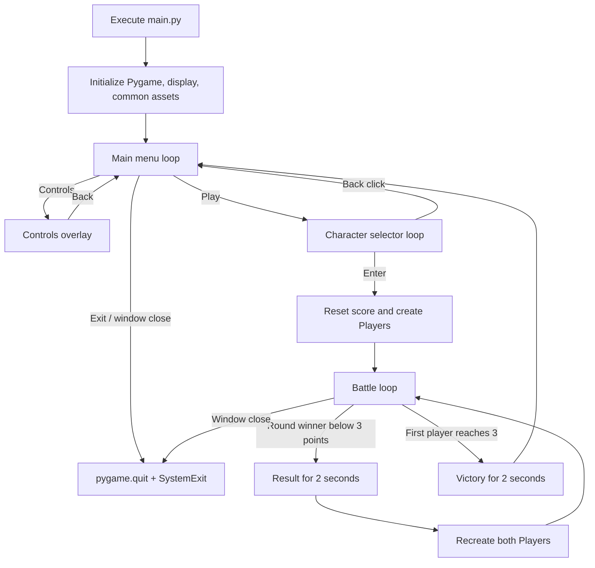
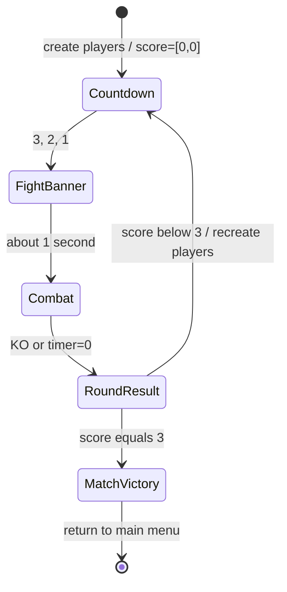
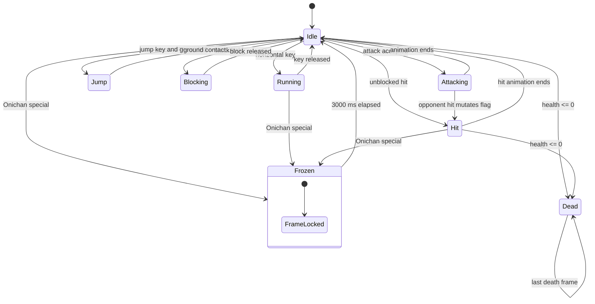
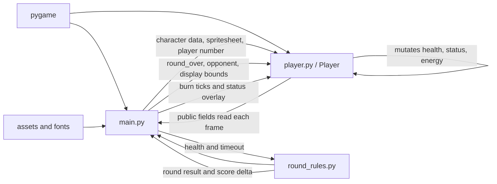

# Current State

This document records the behavior observed in the repository at the audit
baseline. It describes what the code does, including inconsistencies, rather
than a desired design.

## Repository and runtime baseline

- Runtime modules exist at repository root: `main.py`, `player.py`, and the pure
  `round_rules.py`.
- There is no `src/`, package metadata, or scene framework. Focused pytest
  coverage exists for round rules and fresh Player state.
- Python 3.13.0 and Pygame 2.6.1 are the documented and locally validated
  versions.
- The window is fixed at 1000×600 and the target loop rate is 60 FPS.
- Asset loading depends on launching from the repository root on Windows.

## Complete application flow

### Startup

Before the `__main__` guard, `main.py` initializes all Pygame modules, opens the
display, creates the clock, initializes timing/global values, and loads three
images plus six font objects. Importing the module therefore has graphical I/O
side effects. The unconditional `pygame.quit()` at the last line also shuts
Pygame down after a non-main import.

### Main menu and controls

`initial_screen()` loads `scrolling.png` and `controls.png` each time the menu
is entered. It scrolls two copies of the background by 0.2 px per frame and
draws Play, Controls, and Exit rectangles. Only mouse clicks operate these
buttons.

Controls is not a separate scene: `control_show` adds a centered 900×500 image
over the menu. While it is open, underlying buttons are still drawn and their
click handlers remain active. The Back hit rectangle is checked even when the
overlay is closed, although that only resets an already-false flag.

### Character selector

Selection starts with Raruto for Player 1 and Bam for Player 2. `W/S` and
Up/Down wrap through the four-item list. Both may select the same fighter. The
central list outlines each player's choice; a shared choice alternates color
using wall-clock `time.time()`.

Each selector frame:

1. scrolls and draws the background;
2. renders labels and choices;
3. reloads both `pick.png` files;
4. reloads both spritesheets;
5. extracts idle frames from both sheets;
6. advances one shared preview frame index about every 100 ms;
7. handles keyboard/mouse events.

Enter records a provisional round start and returns the two shared configuration
dictionaries. Back returns `(None, None)`. The outer loop then returns to the
menu. The provisional time is replaced during match setup.

## Match lifecycle

### Creation and round reset

Match setup resets `score` to `[0, 0]`, calls `reset_round()`, stores a new
countdown timestamp, loads each selected spritesheet, and constructs Players at
`(200, 310)` and `(700, 310)`. Player 2 starts flipped.

`reset_round()` resets `round_start_time`, `round_over`, `intro_count`,
`fight_displayed`, `fight_display_start`, `last_count_update`,
`round_over_time`, and `winner_name`. Match setup and every later round use
this function. Between rounds both Players are reconstructed from already-loaded
sheets, resetting health, energy, movement, combat, freeze, burn, dash, and
animation fields.

### Countdown, banner, and timer

`ROUND_TIME_LIMIT` is 94,000 ms. The timer starts before the three-second
countdown. After 3 reaches 0, “FIGHT!” appears for about one second. Movement is
enabled afterward, so controllable combat lasts approximately 90 seconds. The
timer is hidden until it reaches 91 seconds and displays truncated integers.
Fighters still run `update()` and draw during the intro, but `move()` is not
called.

### Per-frame combat order

The battle loop does the following:

1. caps frame rate;
2. calculates time remaining;
3. draws scaled background and HUD;
4. draws countdown/banner or, while time remains, calls `move()` for Player 1
   then Player 2;
5. updates animations/death state and draws both players;
6. applies burn ticks while the round is active;
7. resolves KO/timeout/draw once and applies its score delta;
8. handles result/victory and possibly recreates players;
9. generates at most one freeze/burn tint overlay;
10. handles only the window-close event;
11. updates the display.

The ordering matters: burn damage is applied before the outcome resolver, so a
lethal tick ends the round in the same frame. Player 1 movement/attack is still
processed before Player 2, which can affect same-frame interactions.

### KO, timeout, scoring, and victory

- If time expires, higher health receives one score point. Equal health sets
  `winner_name = "No One"` and awards no point.
- A single pure resolver in `round_rules.py` handles both KO and timeout.
  Simultaneous KO is a draw and awards no point.
- During `round_over`, the winner text is shown while Player animations/status
  processing continue.
- Below three points, two seconds after `round_over_time`, both Players are
  recreated and countdown starts again.
- At exactly three points, victory text is drawn, the event loop blocks for two
  seconds with `pygame.time.wait()`, and `run` becomes false.
- Leaving the battle loop reaches the outer loop's menu. There is no direct
  rematch, selector, or result-scene input.

## Player behavior

This diagram is approximate because booleans can overlap. `dashing` and
`burned` are orthogonal flags; freeze can coexist with them. Animation action
priority and freeze's early return determine what is visible.

### Movement and facing

`move()` polls the entire keyboard state. Normal input is permitted only when
not attacking, alive, round active, and not frozen. Walk speed is 10 px per
battle frame, gravity is 2 velocity units per frame, and jump velocity begins
at -30. The floor is `screen_height - 110`; only horizontal screen edges and
the floor are enforced. There is no ceiling, player-player collision, knockback,
or stage geometry. Facing is recalculated from opponent center positions after
movement.

### Attacks and collision

All players share an 80×180 body rectangle, independent of sprite scale.
Attack rectangles extend from the attacker's center in the facing direction
and retain the body height. Normal/special damage is evaluated immediately at
activation. The `surface` arguments to attack methods are unused; debug hitbox
drawing is absent.

Attack input is disabled while `attacking`; when the selected attack animation
ends, a 30-frame cooldown begins. If a key remains held, the attack will fire
again when the cooldown reaches zero. Cooldown decrements only when `move()` is
called, so it pauses during countdown/result and stretches when FPS falls.

### Health, energy, block

Health and energy start at 100 and 10. Normal attacks give the attacker 20
energy for an unblocked hit or 10 when blocked. Energy above 100 is clamped on
the next `update()`. Health above 100 is likewise clamped. Health at or below
zero is set to zero and marks the player dead.

Block is a held state. It cancels input inside its branch but does not have a
time limit. Because block is only refreshed inside the normal-input gate, the
flag may remain true while an incompatible gate such as freeze or round-over is
active.

### Freeze, burn, and dash

Onichan freeze timestamps the target in `Player.freeze_attack()`.
`Player.update()` owns expiry and freezes the current frame (or the final hit
frame). The main battle loop separately builds the blue overlay.

Raruto burn stores its timer and counters on the target, but `main.py` performs
the three delayed damage ticks and red overlay. Burn stops processing once the
round is over.

Bam dash marks both `attacking` and `dashing`, spends energy, and checks a
3.25-body-width hitbox once. Movement then overrides horizontal `dx` for 200 ms.
It does not check collision during travel.

## Animation and asset management

`Player.load_images()` slices one row per action using character-specific frame
counts, scales every extracted frame, and stores them per Player. The main
selector has a separate idle-frame extraction path that does not reuse this
cache. Battle animation advances at 50 ms per frame using elapsed milliseconds;
it advances at most one frame per call and does not carry extra elapsed time.

The status overlay creates a mask from `Player.image`, allocates a transparent
surface of the full scaled cell, and loops over every pixel every battle frame.
The configured `freeze_offset` is separate from the normal scaled sprite offset,
which makes alignment character-specific and fragile.

## Global state and module dependencies

Functions in `main.py` depend implicitly on module globals including `screen`,
fonts, colors, `clock`, fighter configuration, loaded images, timer constants,
blink state, and round state. `character_selection_screen()` declares a global
`elapsed_time` that otherwise has no module-level definition. The battle loop
also creates/updates global names such as `winner_name` and `round_over_time`
through module-scope execution.

## README accuracy at baseline

The description, screenshots, Python version, and Pygame version generally
match the repository. The original badge linked Python text to Oracle/Java and
the run command referenced nonexistent `src/main.py`; those are documentation
errors. Asset license claims cannot be fully validated from the repository
because source-specific license files are absent.
